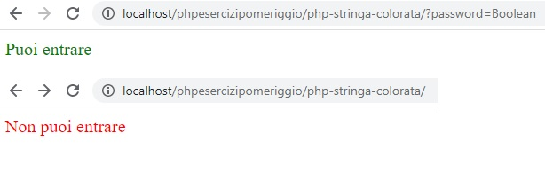

# Php-stringa-colorata
Basic PHP Exercise.

If the Password passed via GET = Boolean, the software prints 'puoi entrare' in a green text otherwise it prints 'non puoi entrare' in red.

HTML, CSS, PHP.
***
### Preview:

